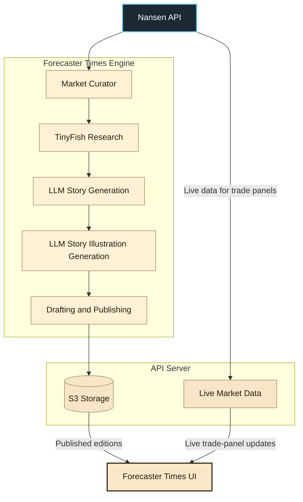

<h1 align="center">Forecaster Times</h1>

<p align="center">
  
</p>

Forecaster Times is an AI-produced prediction-market newspaper. It researches
active Polymarket markets, writes and illustrates newspaper pages, publishes
immutable editions to S3-compatible storage, and presents them in a vintage
Next.js reader with live market data and trading controls.

## Contents

- [Architecture Flow](#architecture-flow)
- [How It Works](#how-it-works)
- [Engine](./engine/README.md)
- [Cron](./cron/README.md)
- [Web](./web/README.md)
- [Development](#development)

## Architecture Flow



## How It Works

### Nansen API

Nansen is the primary market-data source. The engine queries its prediction
market screener endpoints to discover relevant, actively tradable Polymarket markets and
gathers enough candidates across categories as result pages to build each editorial section.
Nansen also supplies live data like prices, OHLCV data to show in dynamic sections like trade
panels.

### Forecaster Times Engine

For every market selected by the curator, TinyFish collects supporting
reporting. An OpenRouter text model turns that material into source-grounded
newspaper copy, and an OpenRouter image model produces a matching illustration.
The engine assembles the resulting stories, illustrations, and initial market
data into front and category pages.

### API Server

The publishing workflow is draft-first. The engine writes working files under
the draft area, records every completed page and illustration in a manifest,
then promotes the publishable set to a numbered edition in S3-compatible
storage. Finally, it updates some metadata to make that edition available to
the reader. The manifest ensures that an unavailable category never prevents
the rest of an edition from appearing.

The API Server also retrieves fresh market data for trade panels. Editorial
pages remain immutable snapshots in storage while their associated market
prices and charts can update independently.

### Forecaster Times UI

The Next.js reader loads global metadata, the edition manifest, and only the
published pages named by that manifest. It presents those pages as a newspaper,
then hydrates their trade panels with current data and lets a connected wallet
place trades on active Polymarket markets.

### Scheduled Publication

A cron job runs the engine as a long-lived Bun service. Its `EDITION_CRON`
environment variable can be set to the desired cadence—for example, every six
hours during active testing or once per day for regular publication. The current
deployment schedule is documented in the [cron package guide](./cron/README.md).

## Packages

### [`engine/`](./engine/README.md)

The editorial domain package. It selects markets through Nansen, researches
news with TinyFish, generates stories and illustrations through OpenRouter, and
persists drafts and published editions to S3-compatible storage. Read the
[engine architecture and API guide](./engine/README.md).

### [`cron/`](./cron/README.md)

The long-running Bun and Hono scheduler. It owns generation credentials and
publishes a complete edition daily through the engine, while exposing only a
small health endpoint. Read the [cron setup and deployment guide](./cron/README.md).

### [`web/`](./web/README.md)

The Next.js reader experience. It reads published editions from storage,
refreshes live market data, and supports Polymarket trading with a connected
wallet. Read the [web data-flow and development guide](./web/README.md).

### [`configs/`](./configs)

Shared TypeScript and Biome configuration for all workspaces.

## Development

Requires Bun `1.4.2` or later.

```sh
bun install
```

Create local environment files from the package templates:

```sh
cp .env.example .env
cp web/.env.example web/.env
cp cron/.env.example cron/.env
```

Start the reader:

```sh
bun dev
```

Start the scheduled editorial process:

```sh
bun --env-file=cron/.env cron/src/index.ts
```

Run all workspace checks:

```sh
bun run lint
bun run check-types
bun run check-scripts
```

## Local Editorial Scripts

With root `.env` configured, use the scripts directly or their matching `just`
recipes:

```sh
# Generate and publish the front page plus every configured category.
bun --env-file=.env scripts/generate-edition.ts

# Generate or resume only the front-page draft.
bun --env-file=.env scripts/generate-front-page.ts

# Generate or resume selected category-page drafts.
bun --env-file=.env scripts/generate-category-page.ts world-politics crypto

# Publish the currently available draft pages as an edition.
bun --env-file=.env scripts/publish-draft-edition.ts
```

Equivalent shortcuts include `just generate-edition`, `just
generate-front-page`, `just generate-category-page world-politics`, and `just
publish-draft-edition`.
